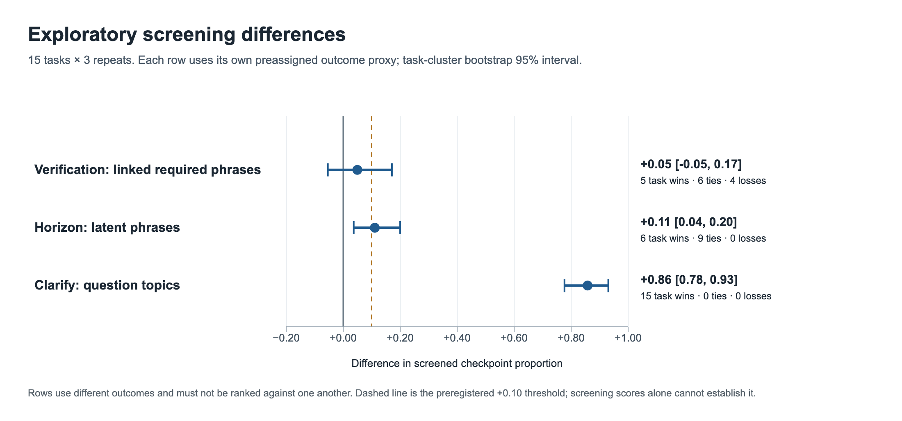
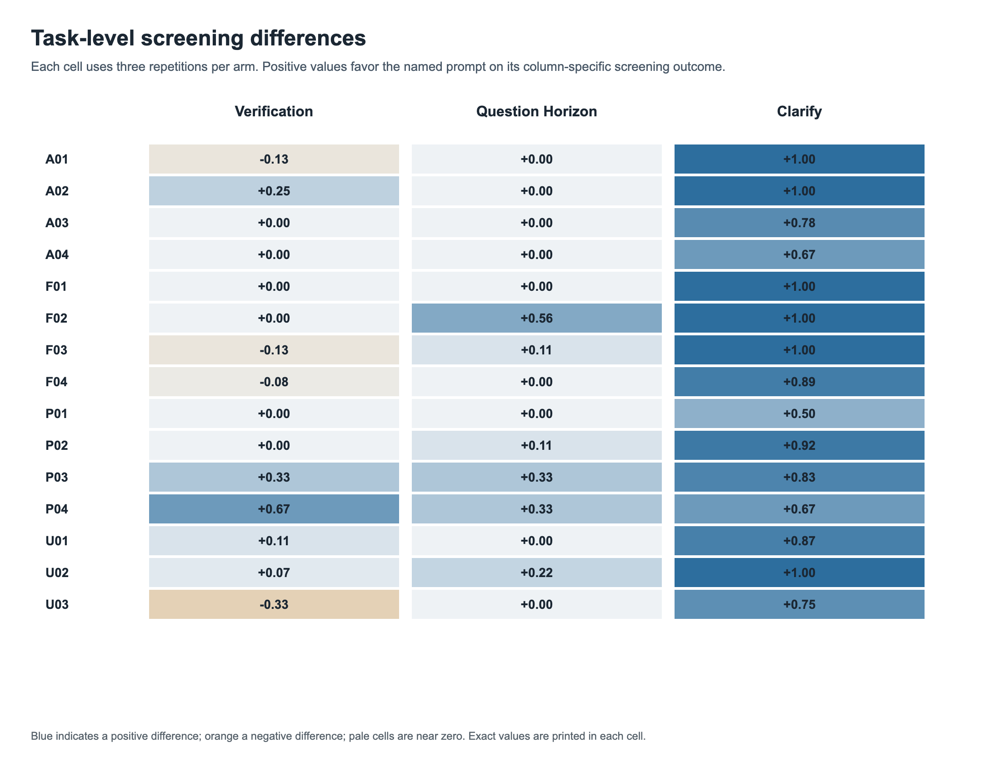
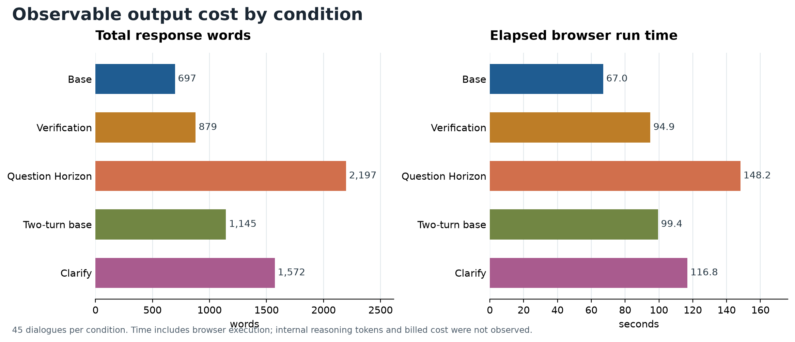

# Local analysis of 225 browser dialogues

**Status, 30 September 2026:** all 225 final dialogues were extracted and screened locally. The figures below are exploratory. The frozen protocol's confirmatory criterion cannot be applied yet because claim-level source support and the material-error rate have not been adjudicated for all 225 answers. No additional Oracle judge outputs were included in this analysis.

## Design and data integrity

- 15 official-source web-research tasks: 4 factual, 4 analytical, 4 practical, and 3 ambiguous.
- Five conditions and three independent browser sessions per task: 225 final dialogues, 45 per condition.
- Matched contrasts: Verification First versus base; Question Horizon versus base; Clarify Then Investigate versus a two-turn base.
- GPT-5.6 Sol, verified High, Web Search, browser engine, concurrency 3. The pilot and earlier API runs are excluded.
- 28 invalid attempts were discarded and replaced with fresh runs. The final set has 225 successful dialogues.
- [Extracted records](results/browser_web_local_records.json), [aggregate summary](results/browser_web_local_summary.json), [frozen 45-dialogue audit sample](results/browser_web_audit_sample.json), and [focused audit log](results/browser_web_focused_audit.json) are the published analysis data. The records include the two turns of two-turn dialogues.

## Observable results

| Condition | Required-phrase coverage | Latent-phrase coverage | Final reply with a direct URL | Mean total response words | Mean elapsed browser seconds |
|---|---:|---:|---:|---:|---:|
| Base | 0.968 | 0.830 | 41/45 | 697 | 67.0 |
| Verification First | 0.951 | 0.822 | 44/45 | 879 | 94.9 |
| Question Horizon | 0.977 | 0.941 | 44/45 | 2,197 | 148.2 |
| Two-turn base | 0.940 | 0.822 | 43/45 | 1,145 | 99.4 |
| Clarify Then Investigate | 0.988 | 0.874 | 44/45 | 1,572 | 116.8 |

The first two columns are rule-based phrase checks against the frozen task rubric. They are **not** factual accuracy scores. Length and time include both assistant turns in two-turn conditions. Browser time is not model-only latency or billed cost.

| Matched comparison | Screening outcome | Mean task-level difference | 95% task-bootstrap interval | Task wins / ties / losses |
|---|---|---:|---:|---:|
| Verification First − base | Required phrases × task-relevant official URL indicator | +0.050 | −0.054 to +0.171 | 5 / 6 / 4 |
| Question Horizon − base | Latent phrase coverage | +0.111 | +0.037 to +0.200 | 6 / 9 / 0 |
| Clarify Then Investigate − two-turn base | First-turn clarification-topic coverage | +0.858 | +0.777 to +0.930 | 15 / 0 / 0 |

The Verification contrast changes sign to **−0.017** (95% task-bootstrap interval **−0.073 to +0.040**) when the URL condition is removed. Missing URL exports are therefore material to that proxy. The Clarify final-answer required-phrase difference versus its two-turn control is **+0.049** (95% interval **+0.013 to +0.090**), below the preregistered +0.10 practical threshold.







## Focused audit and source limits

A 45-dialogue sample (20%, nine per arm) included category-stratified random cases, within-task deviations, and all nine final exports with native citation markers but no direct URL. The sample was frozen before corrections to the URL-host and question-line screen; its exact item list is published so later scoring changes do not silently change the reviewed set. Each packet's answer opening, rubric evidence, first-turn questions, and source-host inventory was inspected; disputed criteria were checked against full saved answers. Eleven checkpoint marks were revised across nine dialogues. This review was not fully blind to condition and did not certify every material claim or link target.

There are 216 final replies with at least one direct task-relevant official-host URL and nine marker-only final exports. Two of the latter have a URL in the first assistant turn, but not the final one. URL presence says nothing by itself about whether a cited page supports the adjacent claim. Missing direct URLs are export/reproducibility defects, not automatically factual errors.

The Clarify condition asked a mean 10.18 first-turn questions; 44/45 runs asked 5–15. One four-question OSIRIS-REx case explicitly explained why a fifth question would add little. The two-turn base asked a mean 0.20 actual questions; URL query strings were excluded from this count. Asking many questions is a behavior change, not proof that every question was necessary. For a simple NIST fact correction, sampled Clarify runs asked 11–12 questions about broader infrastructure and compliance.

## Interpretation

- **Verification First:** no robust content improvement is visible in this screen; replies were longer and slower. The positive URL-linked proxy is sensitive to citation export failures in the base condition.
- **Question Horizon:** more latent issues appeared in six tasks, especially those with genuine hidden dependencies. This cost roughly 3.2× the base word count and 2.2× the browser time. Substantive correctness and source support remain unconfirmed.
- **Clarify Then Investigate:** reliably elicited relevant question topics, but the final-answer proxy gain was small. The second user turn supplied the same full case details to both two-turn arms; it did not answer every individualized clarification question. The result does not measure a full real-world user dialogue.

The frozen decision rule requires a primary-metric gain of at least 0.10, a 95% task-level interval excluding zero, and no material-error increase above 0.05. These proxy results cannot establish that rule because grounded checkpoint scoring and material-error rates are not available. The safest conclusion is about observable behavior and exploratory content coverage, not an accuracy ranking.

## Reproduction

From the repository root, with the completed browser batch available locally:

```bash
python3 evals/extract_browser_local.py --source-batch /path/to/browser-web-final-20260929/batch.json --out-dir /path/to/local-analysis
python3 evals/score_browser_local.py --records /path/to/local-analysis/local_records.json --out-dir /path/to/local-analysis
cp evals/results/browser_web_audit_sample.json /path/to/local-analysis/audit_sample.json
python3 evals/record_browser_focused_audit.py --sample /path/to/local-analysis/audit_sample.json --records /path/to/local-analysis/local_scored_records.json --out /path/to/local-analysis/focused_audit.json
```

The [frozen protocol](BROWSER_WEB_PROTOCOL.md), [case set](browser-web-tasks.json), and [execution audit](EXECUTION_AUDIT.md) give the design, criteria, and retry history. The [Ukrainian DOCX report](../docs/assets/benchmark-225-web-dialogues-uk.docx) contains the full interpretation and four figures.
