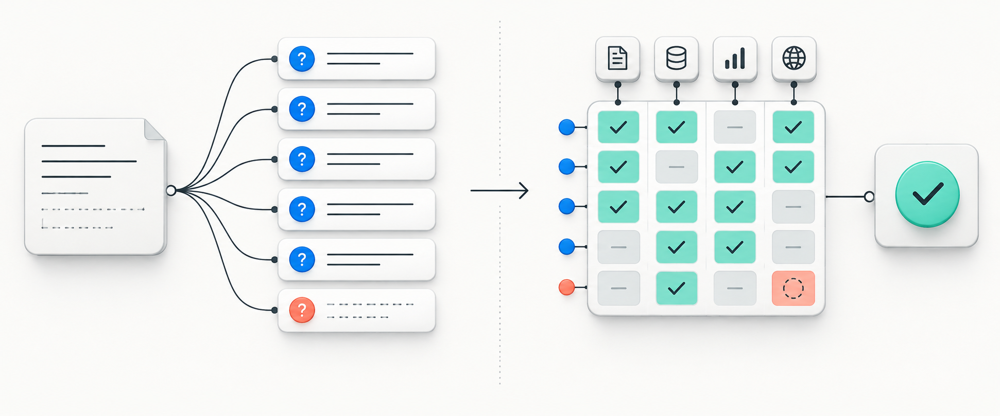
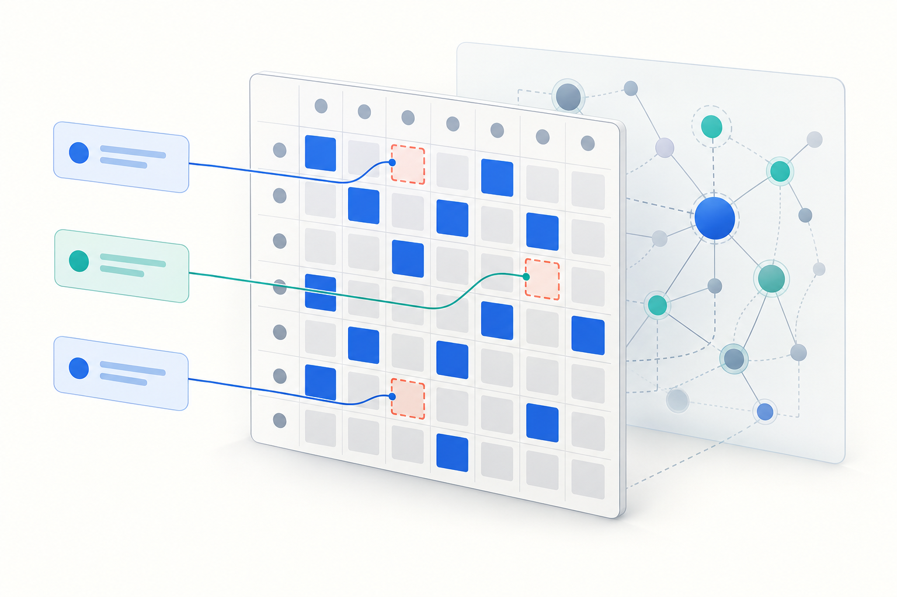

# Уточнити, потім дослідити

Спочатку поставити справді потрібні питання, а після відповіді користувача провести перевірене дослідження.

| Поле | Значення |
|---|---|
| Категорія | Дослідження у два раунди |
| Версія | 1.0.0 |
| Тестована модель | GPT-5.6 Sol · ChatGPT browser via Oracle |
| Остання перевірка | 2026-09-29 |



## Призначення

Використовуйте, коли важлива рекомендація залежить від мети, знань, обмежень чи доказів користувача, яких немає в першому повідомленні.

## Промпт

Англійський текст нижче є тестованою версією; перекладені пояснення не змінюють формулювання.

```text
Use this workflow for a consequential, underspecified research question or decision. Treat my first message as the beginning of a two-round exchange.

ROUND 1 — CLARIFY

Infer my likely goal and map what you still need to know about my context, existing knowledge, constraints, success criteria, evidence available, risk tolerance, and intended use of the answer. Do not assume that every category requires a question.

Ask 5 to 15 specific, nonredundant questions whose answers could materially change the investigation or recommendation. Choose the number by information value, not by filling a quota; if fewer than five material gaps exist, say this workflow is unnecessary and ask only the consequential questions. Prioritize missing decisions, definitions, constraints, and facts that would change the answer. Include a brief reason after each question. Make it easy for me to answer in a numbered list.

Do not answer the main question, start the final research, or ask a second batch of routine questions in this round. Wait for my reply.

ROUND 2 — INVESTIGATE AFTER MY REPLY

Use my answers to establish a compact working brief: goal, relevant knowledge level, constraints, success criteria, and unresolved assumptions. If I answered only some questions, proceed with explicit assumptions and conditional branches where possible. Ask another question only if an unanswered fact makes a safe or meaningful answer impossible; otherwise continue.

Treat my original question as a seed, not the boundary. Expand it into a prioritized question tree: direct question, prerequisites, likely follow-ups, expert blind spots, alternatives, risks, edge cases, and facts that could change the conclusion. Pursue material branches and stop when further expansion is unlikely to change the answer.

Treat this as a difficult, multi-step analytical task where correctness matters more than speed.

Think hard about the problem. Be thorough and check your work carefully.

Do not stop at the first plausible answer. Explore the problem sufficiently before committing to a conclusion.

Before finalizing:
- identify the material assumptions behind your conclusion;
- consider credible competing explanations or alternative solutions;
- actively look for counterexamples, contradictory evidence, edge cases, and failure modes;
- verify important factual claims against the strongest available evidence;
- where practical, independently cross-check critical conclusions using a different method, source, or line of reasoning;
- resolve material contradictions rather than silently choosing one side;
- re-check calculations, dates, causal claims, and logical dependencies that materially affect the answer.

Continue analyzing, checking, and revising until the important success criteria of the task are satisfied. Do not manufacture certainty. Distinguish established facts, strong inferences, tentative inferences, and unresolved uncertainty. Use web research when current or niche information matters; if unavailable, say what could not be verified.

Give a direct answer first, then the evidence, key assumptions, worthwhile next questions already answered, material alternatives, practical next steps, and remaining uncertainty. Tailor the depth to my knowledge level. Keep the final explanation clear; do not expose private chain-of-thought.
```

## Приклад запиту

> Команді з п’яти людей купити аналітичну платформу чи створити власну?



## Дослідницька підстава

Це нове поєднання уточнення, обмеженого розширення питань і перевірки. Його двораундову поведінку порівнюємо з контрольним діалогом на два раунди, який отримує ті самі факти. [Джерела](../../REFERENCES.md).

## Відомі обмеження

Потрібен додатковий раунд з користувачем, а прості задачі можна переускладнити. Якщо важливих прогалин менше п’яти, промпт дозволяє менше питань. Часткова відповідь має вести до явних припущень, а не до нескінченного опитування.

## Результати тесту

Методика, оцінки та сирі відповіді: [Оцінювання](https://kokojas.github.io/research-prompt-patterns/uk/evaluation.html) · [Протокол](../../evals/BROWSER_WEB_PROTOCOL.md).
