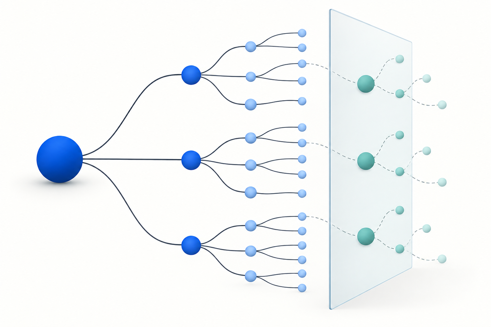
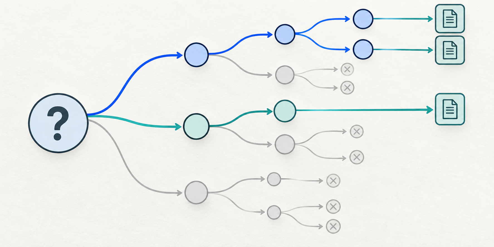

# Горизонт питань

Перетворює одне питання на обмежене дерево передумов, імовірних уточнень, сліпих зон і альтернативних пояснень.

| Поле | Значення |
|---|---|
| Категорія | Випереджальне дослідження |
| Версія | 1.0.0 |
| Тестована модель | GPT-5.6 Sol · ChatGPT browser via Oracle |
| Остання перевірка | 2026-09-29 |



## Призначення

Використовуйте для відкритих запитів, у яких початкове формулювання, ймовірно, пропускає рішення або залежності, про які користувач запитав би згодом.

## Промпт

Англійський текст нижче є тестованою версією; перекладені пояснення не змінюють формулювання.

```text
Treat my question as a seed for the investigation, not as the boundary of it.

Infer the broader underlying problem or decision I am trying to understand.

Before producing the final answer, expand my question into a structured question tree.

Identify and investigate:

1. Questions explicitly contained in my prompt.
2. Questions that must be answered before my question can be answered correctly.
3. Questions that would naturally arise after learning the initial answers.
4. Important questions a knowledgeable expert would ask that a beginner probably would not know to ask.
5. Hidden assumptions in my question.
6. Relevant prerequisites and dependencies.
7. Edge cases and exceptions.
8. Failure modes and risks.
9. Competing explanations.
10. Alternative approaches or interpretations.
11. Contradictory evidence.
12. Common misconceptions.
13. Information that could materially change the conclusion.
14. Known unknowns: things that are recognized as uncertain or unresolved.
15. Potential blind spots suggested by adjacent research, expert discussions, or evidence.

Recursively examine important new questions that emerge from the answers.

Do not expand indefinitely or add irrelevant trivia. Prioritize branches by relevance to my likely goal, probability that I would ask about them later, importance if overlooked, uncertainty, and potential to change the conclusion.

Use web research where current or niche information matters. If browsing is unavailable, say so and distinguish unverified claims from checked facts.

Continue exploration until additional research produces little material new information.

Then give me:

A. A direct answer to my original question.
B. Expanded findings.
C. Questions I would probably have asked next, with answers already included.
D. Important things I might not have known to ask about.
E. Contradictions and alternative explanations.
F. Remaining uncertainties and information that cannot currently be established.
G. Information that would most change the conclusion.

Do not expose private chain-of-thought. Show only the resulting question structure, evidence, conclusions, and uncertainties.
```

## Приклад запиту

> Чи варто команді переносити внутрішні нотатки до нового інструмента?



## Дослідницька підстава

Дослідження Self-Ask показує користь проміжних питань для багатокрокових задач. Цей промпт додатково передбачає майбутні питання та експертні сліпі зони, тож саме ці доповнення потребують прямого тесту. [Джерела](../../REFERENCES.md).

## Відомі обмеження

Модель може неправильно вгадати мету. Довге дерево питань здатне приховати пряму відповідь або додати зайве; гілки треба ранжувати за впливом на рішення й своєчасно зупинятися.

## Результати тесту

Методика, оцінки та сирі відповіді: [Оцінювання](https://kokojas.github.io/research-prompt-patterns/uk/evaluation.html) · [Протокол](../../evals/BROWSER_WEB_PROTOCOL.md).
