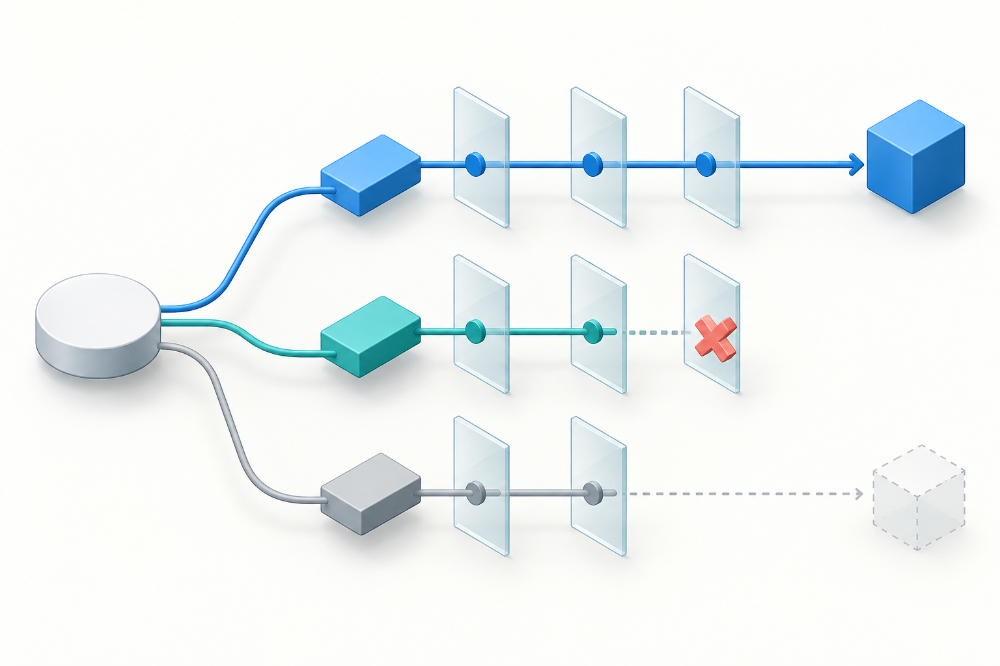
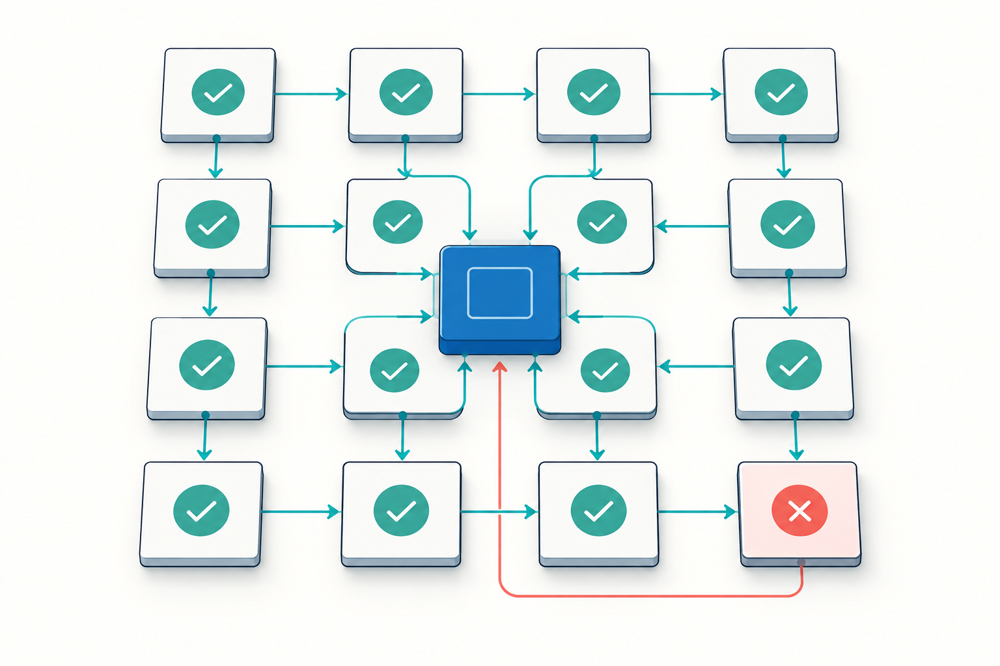

# Verification First

A compact contract for checking assumptions, alternatives, calculations, and uncertainty before answering.

| Field | Value |
|---|---|
| Category | Analytical reliability |
| Version | 1.0.0 |
| Tested model | GPT-5.6 Sol API via Oracle 0.21.3 |
| Last verified | 2026-09-29 |



## Purpose

Use it when a plausible first answer could still be wrong: policy interpretation, quantitative decisions, causal claims, or evidence-heavy synthesis.

## Prompt

Append this exact text to a task request.

```text
Treat this as a difficult, multi-step analytical task where correctness matters more than speed.

Think hard about the problem. Be thorough and check your work carefully.

Do not stop at the first plausible answer. Explore the problem sufficiently before committing to a conclusion.

Before finalizing:

- identify the material assumptions behind your conclusion;
- consider credible competing explanations or alternative solutions;
- actively look for counterexamples, contradictory evidence, edge cases, and failure modes;
- verify important factual claims against the strongest available evidence;
- where practical, independently cross-check critical conclusions using a different method, source, or line of reasoning;
- resolve material contradictions rather than silently choosing one side;
- re-check calculations, dates, causal claims, and logical dependencies that materially affect the answer.

Continue analyzing, checking, and revising until the important success criteria of the task are satisfied.

Do not manufacture certainty. Clearly distinguish established facts, strong inferences, tentative inferences, and unresolved uncertainty.

Optimize the underlying analysis for correctness, completeness, and robustness rather than speed. The final answer may be concise when appropriate, but do not reduce the depth of analysis or verification merely to make it shorter.

Provide the final conclusions, supporting evidence, important caveats, and concise rationale; do not expose private chain-of-thought.
```

## Example task

> Which of two recovery plans meets a 15-minute RPO and a two-hour RTO?



## Research basis

The short “think hard” cue increased reported reasoning tokens in a small published test; independent-verification research supports the mechanism. Neither establishes the accuracy of this full prompt. [References](../REFERENCES.md).

## Known limitations

It cannot switch the model's actual effort setting or guarantee that verification happened. Without evidence or tools, self-checking may be superficial; extra length can add cost without improving accuracy.

## Evaluation

Protocol, scores, and raw responses: [Evaluation](https://kokojas.github.io/research-prompt-patterns/evaluation.html) · [Protocol](../evals/PROTOCOL.md).
